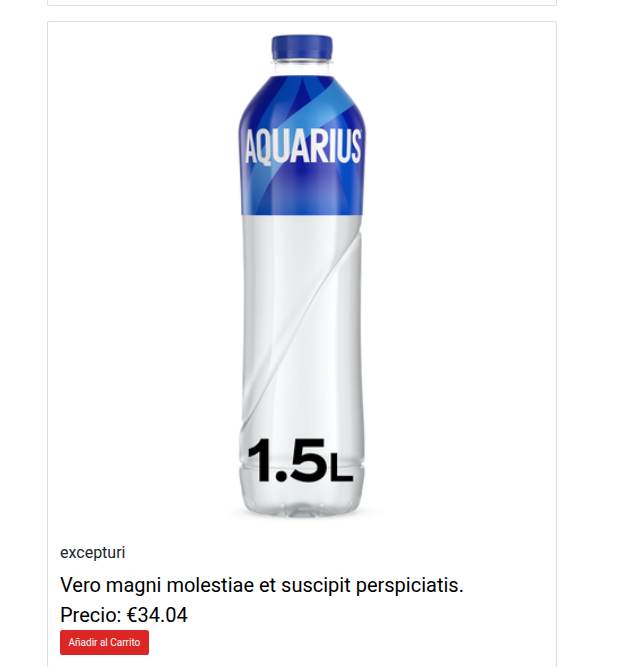
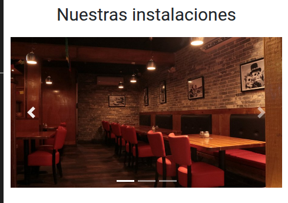
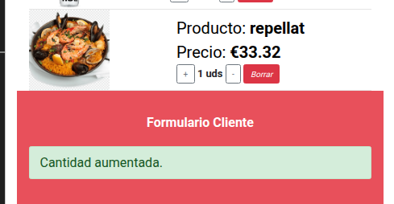
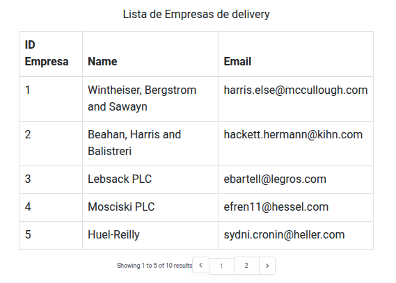

# Trabajo Desarrollo Web Entorno Servidor – 2ª Evaluación

## Objetivo  
Desarrollar un sistema básico para un restaurante en Laravel que permita gestionar platos, pedidos y clientes. No será una plataforma de compra real, sino un proyecto funcional con modelos, controladores y vistas.

Consideraciones, este trabajo me gustaria retomarlo en un futuro, y poder reciclar el backend
es un projecto mas que puedo poner en mi portafolio, el frontend si que se ve bien y seguramente lo cambie (cambien la organizacion de los archivos, visualmente si que se ve como quiero), porque hay mucha mezcla en el proyectro actualmente esta boostrap, tailwind.css, css nativo que he reciclado el codigo visualmente.

- me gustaria que creciera y se pareciera mas a una app glovo, y que las empresas se puedan registrar,y crear sus productos, esta aunmuy lejos de eso peor es una primera version
- en la fp laravel es lo que mas he visto y dedicado tiempo, que mas que tener un solo proyecto
- como lo normal es que se trabaje el codigo en ingles la mayoria lo es, aunque hay muchos spanglish

## Estructura de la Aplicación  
El proyecto se llama `app_comida` y tendrá los siguientes elementos:

### **Modelos**  
- `Cliente.php` (id, nombre, teléfono, tarjetaCredito)  
- `EmpresaDelivery.php` (id, nombre, email)  
- `Plato.php` (id, nombre, precio)  
- `Pedido.php` (id, idCliente, precioTotal)  
- `Plato_Pedido.php` (idPlato, idPedido)  

Pasa a:

### **Modelos**  
- `User.php` (id, nombre, teléfono, tarjetaCredito)  

Es que esta por defecto, y como estoy usando breeze me sirve un monton y reciclo esa logica, esa magia de laravel por detras, breeze usa los campos emai y password para hacer su magia, pues esos campos los dejo y simplmente añado los demas que requiere el proyecto

- `CompanyDeliveries.php` (id, nombre, email)  
- `Product.php` (id, nombre, precio)  
- `Order.php` (id, idCliente, precioTotal)  
- `ProductOrder.php` (idPlato, idPedido)  

### **Vistas**  
- `Inicio.blade.php`  
- `Platos.blade.php`  
- `Empresas.blade.php`  
- `Pedidos.blade.php`  
- `FormularioCliente.blade.php`  
- `FinPedido.blade.php`  

Pasa a:

### **Vistas**  
- `home.blade.php`  
- `products.blade.php`  
- `companiesDeliveries.blade.php`  
- `order.blade.php`  
- `formCustomer.blade.php`  
- `endOrder.blade.php`  

### **Otros elementos**  
- **Controladores**: Se crean para todos los modelos excepto `ProductOrder`.  
- **Migraciones**: Asociadas a todos los modelos.  
- **Factories**:  
  - `UserFactory` (10 clientes con datos aleatorios).  
  - `CompanyDeliveryFactory` (10 empresas con email corporativo).  
  - `ProductFactory` (20 platos aleatorios).  
- **Requests**: `DatosCliente.php` (validaciones).  
- **Rutas**: Definidas en `web.php`.  

## Funcionalidad de la Aplicación  
- **Inicio**: Nombre del restaurante, imágenes y acceso a Platos.  
- **Platos**: Header de navegación, tabla paginada (5 por página), opción de añadir al pedido y acceso a `FormularioCliente`.  
- **FormularioCliente**: Formulario con validaciones para teléfono y tarjeta, selección de empresa de delivery.  
- **FinPedido**: Mensaje de confirmación con botones a Inicio y Platos.  
- **Empresas**: Tabla paginada de empresas (5 por página).  
- **Pedidos**: Tabla con los últimos 10 pedidos (usuario y precio total).  

### **Bootstrap**  
Se deben incluir 5 elementos de Bootstrap como botones, cards o alerts.

- cards y btn de boostrap

- en la home hay un slider de boostrap

- alert cuando haces una modificacion al carrito

-- tabla y paginacion

## Consideraciones  
- Cada vez que un cliente haga un pedido, se guardará un nuevo registro de cliente, pedido y su relación en `Plato_Pedido`.  
- Se permite usar PHP más allá de Laravel.  
- Flexibilidad en rutas, controladores y métodos, siempre que se respete la funcionalidad.  

## **Punto Extra**  
- Implementar **Login/Register** para clientes.  
- Un cliente registrado no necesitará completar el formulario en cada pedido.  
- No pueden registrarse clientes con el mismo nombre.  

## **Evaluación (30% de la nota final)**  
- **Estructura de vistas correcta** (+1,5)  
- **Tablas de platos, empresas y pedidos funcionales** (+1)  
- **Datos de clientes y pedidos añadidos correctamente en BBDD** (+2)  
- **Formulario con validaciones correctas** (+2)  
- **Migraciones y factories bien definidas** (+1,5)  
- **Uso de 5 elementos Bootstrap** (+1)  
- **Estética bien estructurada (CSS y HTML)** (+1)  

## **Entrega**  
- Fecha límite: **17 de febrero a las 23:59** en **Aeducar**.  
- Formato de entrega: **Proyecto comprimido** en `trabajo2ev_NombreApellido.zip`.  
- **El trabajo es individual**, cualquier copia resultará en suspensión con **nota 0**.  
